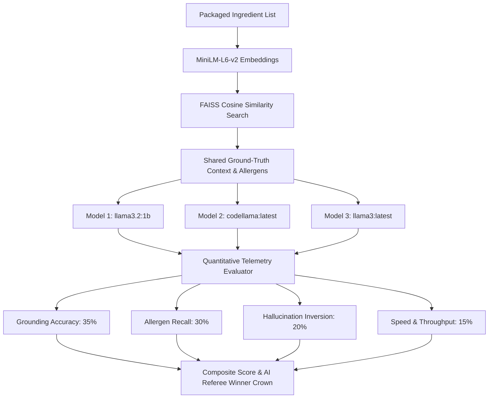

# 🥫 Food Label Decoder · Professional RAG AI Studio

An end-to-end **Retrieval-Augmented Generation (RAG)** platform that analyzes packaged food ingredient lists, E-numbers, additives, and allergens with strict local knowledge grounding.

Built with **Ollama** + **Llama 3.2 / Llama 3 / Code Llama** + **FastAPI** + **FAISS** + **Sentence-Transformers (`all-MiniLM-L6-v2`)** + **Docker**.

---

## 🌟 Key Highlights & Platform Capabilities

- ⚔️ **Side-by-Side Multi-Model Evaluation & AI Referee:** Benchmarks all locally installed Ollama models (`llama3.2:1b`, `llama3:latest`, `codellama:latest`) on the exact same ingredient label. Displays their decoded answers side-by-side in equal columns and crowns the top winner with a golden border.
- 🏆 **Dynamic Best Model Winner Bar:** Automatically calculates real-time telemetry (Latency, Throughput, Grounding %, Allergen Recall %, Hallucination Rate, Composite Score) and writes an AI Referee explanation of *why* the winning model gave the best answer.
- 🚨 **Clinical Allergen & Sensitivity Mapping:** Detects food allergens (Gluten, Dairy, Soy, Peanuts, Tree Nuts, Eggs, Sulphites, Tartrazine, Sesame, Fish/Shellfish) and maps them to severity grades (`Critical`, `Severe`, `Moderate-High`, `Sensitivity`) with dietary guidance.
- 🌿 **Grounded RAG Intelligence:** Prevents LLM hallucinations by retrieving exact Codex Alimentarius and FDA food additive records.
- 📦 **Curated 44-Record Knowledge Base:** Comprehensive data on emulsifiers, acidity regulators, stabilizers (INS 407, 412, 415, 466), thickeners (INS 440), colorants (INS 102, 127, 160c), oils, and allergen classes.
- ⚖️ **Single-Model Evaluation:** Direct comparison of **RAG Grounded Response** vs **Baseline (Without RAG)** to demonstrate grounding efficacy.
- 🌓 **Modern Glassmorphism UI:** Clean dark-mode interface with rendered markdown typography, live RAG pipeline tracker, high-contrast badges, fluid animations, and responsive layout.

---

## 📂 Data Storage & Schema Format

The platform persists knowledge and vector representations across three structured layers:

### 1. Raw Knowledge Base (`knowledge_base/data.json`)
* **Format:** JSON Array of 44 curated food records.
* **Fields:** `id`, `name`, `synonyms`, `e_number`, `category`, `function`, `common_uses`, `allergen_info`, `health_considerations`, `source`.

```json
{
  "id": "ing_wheat_flour",
  "name": "Wheat flour",
  "synonyms": ["wheat", "flour", "enriched wheat flour", "whole wheat flour"],
  "e_number": null,
  "category": "grain / base ingredient",
  "function": "Provides structure, texture and bulk in baked and processed foods.",
  "common_uses": "Bread, pasta, crackers, breading/coatings, thickeners in sauces.",
  "allergen_info": "Contains gluten. Direct allergen: wheat. Also relevant to people with celiac disease or gluten sensitivity.",
  "health_considerations": "A source of carbohydrates and some protein.",
  "source": "Codex Alimentarius / FDA Food Labeling Guide"
}
```

### 2. RAG Chunk Store (`embeddings/chunks.json`)
* **Format:** JSON Array of chunk objects prepared for neural search.
* **Fields:** `chunk_id`, `text` (formatted text block for MiniLM embedding), `metadata` (structured copy of the record).

### 3. Dense Vector Matrix (`embeddings/vectors.npy`)
* **Format:** NumPy Binary Array (`.npy`)
* **Shape:** `(44, 384)` — 44 vectors with 384 dimensions each, generated by `all-MiniLM-L6-v2` and L2-normalized for FAISS Inner Product (`IndexFlatIP`) cosine similarity search.

---

## 📂 Detailed Project File Structure

```text
food-label-decoder/
├── app/                                 # Monolithic Application & API
│   ├── main.py                          # FastAPI backend orchestrator & API endpoints
│   ├── ollama_client.py                 # Isolated Ollama gateway with dynamic model discovery
│   └── static/
│       └── index.html                   # Professional RAG AI Studio frontend UI
│
├── rag/                                 # Vector Database & Retrieval Pipeline
│   ├── vector_store.py                  # FAISS IndexFlatIP (Inner Product) wrapper
│   ├── retriever.py                     # Recursive balanced-parenthesis tokenizer & cosine search
│   ├── rag_pipeline.py                  # Prompt synthesis, context assembly & allergen classifier
│   └── model_comparator.py              # Multi-model arena benchmarking & AI Referee engine
│
├── ingestion/                           # Knowledge Ingestion & Embedding Pipeline
│   ├── chunker.py                       # Converts raw knowledge base records into text chunks
│   └── embedder.py                      # Generates 384-d MiniLM embeddings & FAISS files
│
├── knowledge_base/
│   └── data.json                        # Curated database of 44 food additives, allergens & E-numbers
│
├── embeddings/                          # Generated vector store artifacts
│   ├── chunks.json                      # Serialized chunk metadata & text passages
│   └── vectors.npy                      # 384-dimensional normalized float32 embedding matrix
│
├── eval/                                # Evaluation & Quality Metrics Suite
│   ├── metrics.py                       # Grounding accuracy, allergen recall & hallucination scoring
│   ├── questions.json                   # Curated test benchmark queries
│   └── test_retrieval.py                # Automated retrieval & vector search unit tests
│
├── services/                            # Microservices Architecture
│   ├── app_service/                     # Public Web API & Frontend Host (Port 8000)
│   ├── rag_service/                     # FAISS Vector Search Microservice (Port 8001)
│   ├── llm_service/                     # Ollama / LLM Communication Service (Port 8002)
│   └── data_service/                    # Knowledge Base & Index Builder Service (Port 8003)
│
├── docker-compose.yml                   # Multi-container orchestration specification
├── requirements.txt                     # Dependencies for local development
└── README.md                            # Main project documentation
```

---

## 🚀 How to Run the Project

### Option 1: Local Development Server (Recommended)

1. **Install dependencies:**
   ```powershell
   pip install -r requirements.txt
   ```

2. **Ensure Ollama is running:**
   ```powershell
   ollama serve
   ```

3. **Check available models (pull lightweight 1B model for high-speed multi-model evaluation):**
   ```powershell
   ollama list
   ollama pull llama3.2:1b
   ```

4. **Build the vector store:**
   ```powershell
   python -m ingestion.embedder
   ```

5. **Start the FastAPI backend:**
   ```powershell
   uvicorn app.main:app --reload --port 8000
   ```

6. **Open in browser:**  
   Navigate to **[http://localhost:8000](http://localhost:8000)**.

---

### Option 2: Full Docker Microservices Stack

Runs the complete 5-container architecture (App, RAG, Data, LLM services + Ollama) in isolated containers:

```powershell
docker compose up --build -d
```

Open **[http://localhost:8000](http://localhost:8000)**.

---

## 🔌 API Reference

| Method | Endpoint | Description |
| :--- | :--- | :--- |
| `GET` | `/` | Serves the interactive RAG AI Studio Web UI |
| `GET` | `/api/health` | System health, vector index status & discovered Ollama models |
| `GET` | `/api/models` | List of installed Ollama models |
| `GET` | `/api/chunks` | Returns all 44 knowledge base chunks and metadata |
| `GET` | `/api/vectors` | Returns vector dimensions and index information |
| `POST` | `/api/query-embed` | Embeds an ingredient query and computes similarity scores |
| `POST` | `/api/decode` | **RAG Grounded Decode:** Retrieves context, detects allergens, and generates grounded report |
| `POST` | `/api/decode_no_rag` | **Baseline Decode:** Generates analysis from LLM parametric memory without retrieval |
| `POST` | `/api/compare_models` | **Multi-Model Arena:** Benchmarks all models, measures telemetry & generates AI Referee verdict |

---

## 🏆 How We Evaluate & Select the Best Model (Scoring Methodology)

The platform evaluates all locally installed models using a strict, multi-dimensional quantitative benchmark powered by shared FAISS retrieval:



### 1. The Multi-Criteria Scoring Formula (100-Point Scale)

$$\text{Composite Score} = (0.35 \times \text{Grounding}) + (0.30 \times \text{Allergen Recall}) + (0.20 \times (100 - \text{Hallucination})) + (0.15 \times \text{Speed Score})$$

| Metric | Weight | Evaluation Criteria |
| :--- | :---: | :--- |
| **🎯 Grounding Accuracy** | **35%** | Verifies that the model's explanations strictly adhere to the retrieved Codex Alimentarius / FDA knowledge base records and cite verified additive functions. |
| **🛡️ Allergen Recall** | **30%** | Measures whether 100% of the true clinical allergens present on the label (e.g. Gluten/Wheat, Milk, Peanuts/Groundnut, Soy, Egg, Sulphites) were explicitly identified in the output. |
| **🚫 Hallucination Inversion** | **20%** | $(100\% - \text{Hallucination Rate})$. Penalizes models for inventing unverified safety claims or hallucinating functions for items not in the knowledge base. |
| **⚡ Speed & Throughput** | **15%** | Evaluates response latency and tokens-per-second throughput normalized against interactive UI targets ($\text{Normalized } 3.0 / (\text{Latency}_{\text{sec}} + 0.5)$). |

### 2. AI Referee Decision Synthesis
- The **AI Referee** inspects the outputs of all evaluated models against the ground-truth FAISS context.
- The model with the highest composite score is crowned **Champion**, highlighted with a golden card border, and accompanied by an auto-generated rationale explaining its performance trade-offs (e.g. why a model won despite higher latency if it had 0% hallucinations and 100% allergen recall).

---

## 🥜 Food Allergen & Botanical Taxonomy Note: "Groundnut vs Peanut"

When analyzing ingredients like **`hydrolysed groundnut protein`**:
* **Botanical Fact:** **Groundnut** (*Arachis hypogaea*) is the standard Indian and British English botanical term for **Peanut**.
* **Clinical Significance:** Hydrolysed groundnut protein contains concentrated legume allergen proteins that can trigger life-threatening anaphylactic reactions in individuals with peanut allergies.
* **Platform Mapping:** The system automatically flags groundnut under `Peanuts / Groundnut` with a `SEVERE` clinical warning to protect consumers across all regional labeling conventions.

---

## 🧪 Automated Testing

Run the test suite to verify vector retrieval accuracy and similarity thresholds:

```powershell
python -m unittest eval/test_retrieval.py
```

